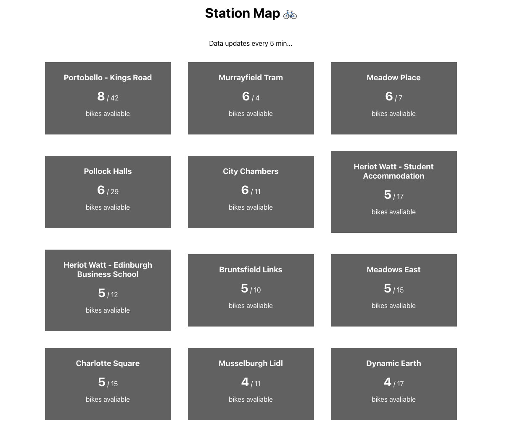

# Just Eat Cycles Data 🚲

Messing around with the [open data](https://edinburghcyclehire.com/open-data) provided by Just Eat Cycles.

</img>

## Backend:

### Run API:

```shell
cd backend
python3 -m pip install -r requirements.txt
python3 get_station_data.py # fetches the latest station data (json files)
python3 station_api.py # runs the api
```

### Routes:

```
Endpoint               Methods  Rule
---------------------  -------  -----------------------------
all_stations           GET      /
biggest_station_bikes  GET      /biggest_station_bikes
biggest_station_docks  GET      /biggest_station_docks
get_station            GET      /station/<station_identifier> refers to station name or id
```

## Frontend:

Backend API has to be running first.

```shell
cd frontend
npm install
npm run start
```
